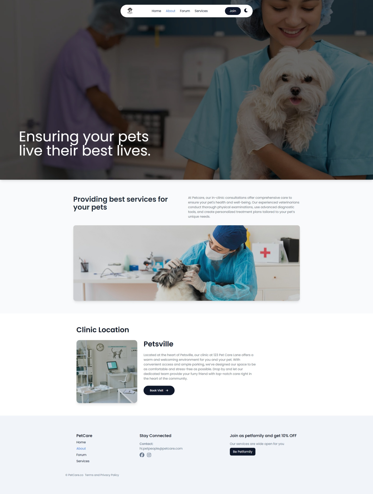
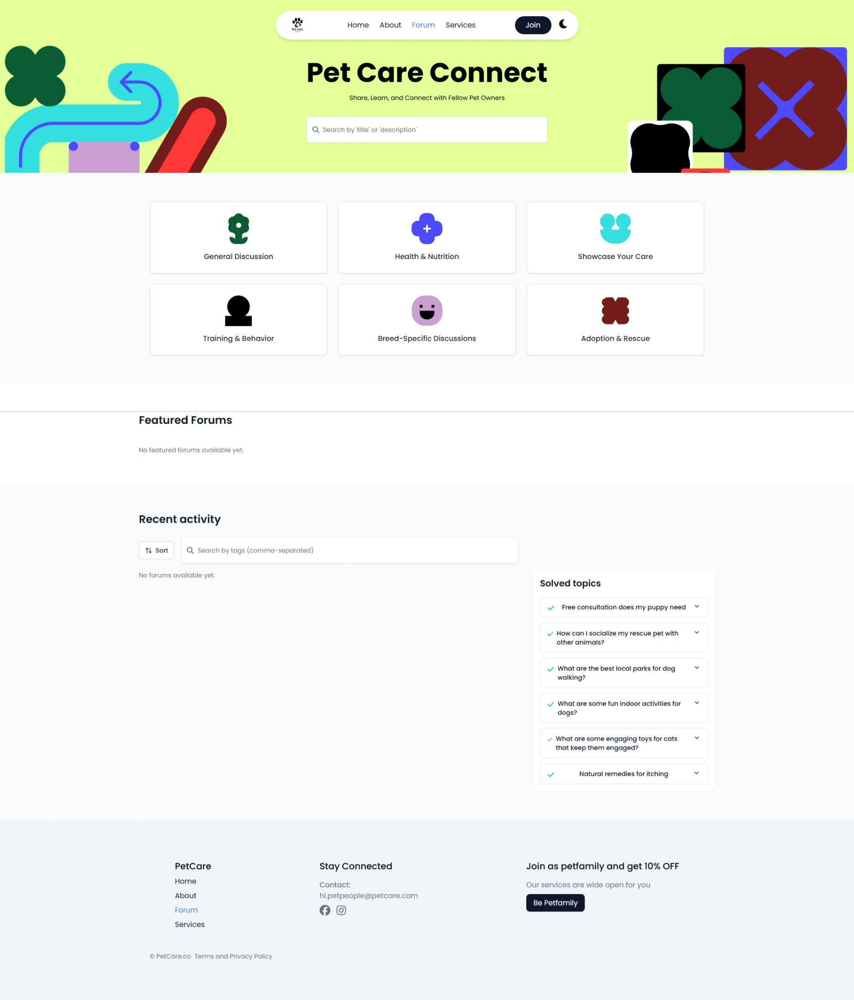
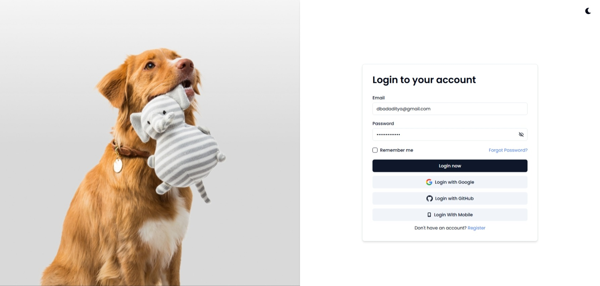

# 🐾 PetCareConnect

[](https://petcareconnect.netlify.app)

[](https://petcareconnect.netlify.app)

[](https://petcareconnect.netlify.app)

[](https://petcareconnect.netlify.app)

This project, **PetCareConnect**, is a modern forum application where pet owners connect, share thoughts, suggestions, and advice regarding their pets. It is built with a scalable **Microservices** architecture.

[](https://opensource.org/licenses/MIT)
[](https://www.oracle.com/java/)
[](https://spring.io/projects/spring-boot)
[](https://reactjs.org/)
[](https://www.typescriptlang.org/)

A modern community platform for pet owners to connect, share knowledge, and discuss pet care topics. Built with a microservices architecture for scalability and performance.

## ✨ Features

- **User Authentication**

  - Secure JWT-based authentication
  - Social login (Google, GitHub)
  - Email verification
  - Password reset functionality

- **Forum System**

  - Create and manage discussion threads
  - Comment on posts
  - Like and interact with content
  - Categorize discussions

- **User Profiles**

  - Personal information management
  - Pet information tracking
  - Forum activity history
  - Appointment scheduling (future)

- **Admin Dashboard**
  - User management
  - Content moderation
  - System monitoring

## 🚀 Tech Stack

### Frontend

- **Framework**: React 18 with TypeScript
- **State Management**: Redux Toolkit
- **Styling**: Tailwind CSS + shadcn/ui
- **Build Tool**: Vite
- **Form Handling**: React Hook Form with Zod validation
- **Routing**: React Router v6
- **Icons**: Lucide React

### Backend

- **Framework**: Spring Boot 3.4.1 (Java 17)
- **Security**: Spring Security with JWT
- **Database**:
  - MySQL: User data, profiles
  - MongoDB: Forum posts, comments
  - Redis: Caching, rate limiting
- **APIs**: RESTful architecture
- **External Services**:
  - Cloudinary: Image upload and management
  - Twilio: SMS notifications
  - Email service: Transactional emails

## 🛠️ Prerequisites

- Java 17 or higher
- Node.js 18+ and npm 9+
- Docker and Docker Compose
- MySQL 8.0+
- MongoDB 6.0+
- Redis 7.0+

## 🚀 Quick Start

### Using Docker (Recommended)

1. Clone the repository:

   ```bash
   git clone https://github.com/mraditya1999/petcare-connect.git
   cd petcare-connect
   ```

2. Copy the example environment files:

   ```bash
   cp backend/.env.example backend/.env
   cp frontend/.env.example frontend/.env
   ```

3. Start the application stack:

   ```bash
   docker-compose up --build -d
   ```

4. Access the application:
   - Frontend: https://petcareconnect.netlify.app
   - Backend API: https://petcare-connect-production.up.railway.app
   - API Documentation: https://petcare-connect-production.up.railway.app/api/v1/swagger-ui/index.html

#### Backend

1. Navigate to the backend directory:

   ```bash
   cd backend
   ```

2. Configure environment variables in `.env` file

3. Build and run:
   ```bash
   mvn clean install
   mvn spring-boot:run
   ```

#### Frontend

1. Navigate to the frontend directory:

   ```bash
   cd frontend
   ```

2. Install dependencies:

   ```bash
   npm install
   ```

3. Configure environment variables in `.env` file

4. Start the development server:
   ```bash
   npm run dev
   ```

## 📚 Documentation

- [API Documentation](http://localhost:8080/swagger-ui.html) (available when running locally)
- [Database Schema](./docs/DATABASE.md)
- [API Endpoints](./docs/API.md)
- [Deployment Guide](./docs/DEPLOYMENT.md)

## 🤝 Contributing

Contributions are welcome! Please read our [contributing guidelines](CONTRIBUTING.md) to get started.

1. Fork the repository
2. Create your feature branch (`git checkout -b feature/AmazingFeature`)
3. Commit your changes (`git commit -m 'Add some AmazingFeature'`)
4. Push to the branch (`git push origin feature/AmazingFeature`)
5. Open a Pull Request

## 📄 License

This project is licensed under the MIT License - see the [LICENSE](LICENSE) file for details.

## 👨‍💻 Author

- **Aditya Yadav** - [@mraditya1999](https://github.com/mraditya1999)
  - [Portfolio](https://adityayadav-dev.netlify.app)
  - [LinkedIn](https://www.linkedin.com/in/mraditya1999/)
  - [Twitter](https://twitter.com/mraditya1999)

## 🙏 Acknowledgments

- Thanks to all contributors who have helped shape this project
- Built with amazing open source technologies
